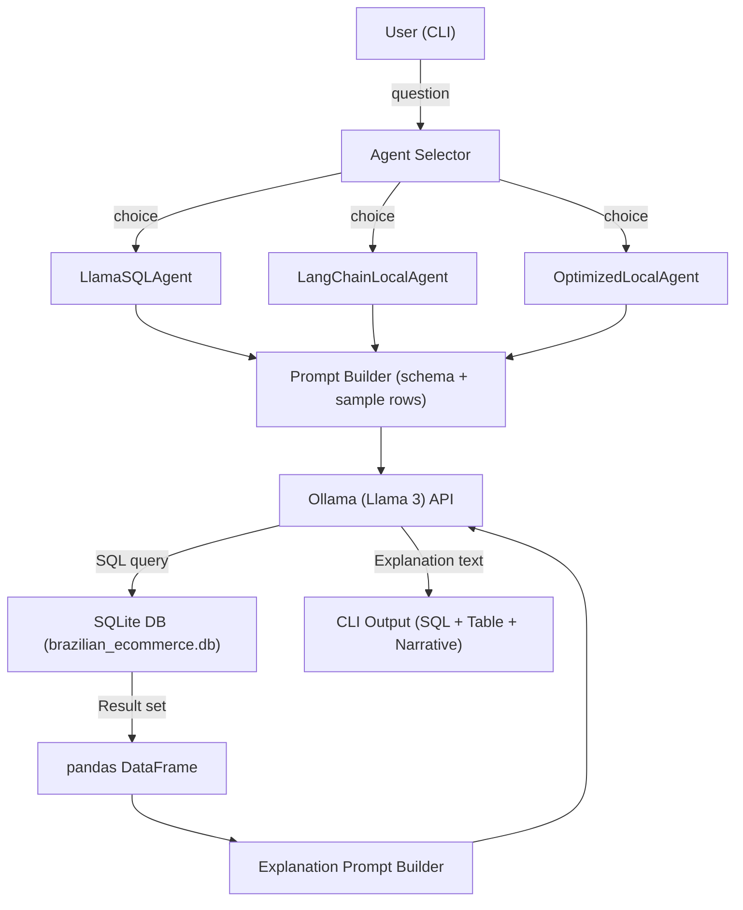

# AI Data Analyst Agent – Local Llama 3 Edition  
*(100 % offline, large‑dataset ready, generative‑AI powered)*  

---  

  
  
  
  
  

---  

## 📖 Table of Contents  

1. [Project Overview](#-project-overview)  
2. [Why Llama 3 + Ollama?](#-why-llama3--ollama)  
3. [Dataset – Brazilian E‑Commerce (Olist)](#-dataset---brazilian-ecommerce-olist)  
4. [Architecture Diagram](#-architecture-diagram)  
5. [Repository Structure](#-repository-structure)  
6. [Prerequisites](#-prerequisites)  
7. [Installation & Setup](#-installation--setup)  
8. [Running the Project](#-running-the-project)  
9. [Agents Overview](#-agents-overview)  
10. [Example Queries & Expected Output](#-example-queries--expected-output)  
11. [Testing](#-testing)  
12. [Contributing](#-contributing)  
13. [Roadmap & Future Improvements](#-roadmap--future-improvements)  
14. [License](#-license)  
15. [Acknowledgements](#-acknowledgements)  
16. [FAQ](#-faq)  

---  

## 🚀 Project Overview  

The **AI Data Analyst Agent** is a **fully offline** analytical assistant that can:

* Understand natural‑language questions about a structured dataset.  
* Generate **optimised SQLite SQL** queries on‑the‑fly.  
* Execute the queries against a **large (> 100 k rows) relational database**.  
* Produce a **human‑readable explanation** of the results, all powered by a **local Llama 3** model.  

The solution was built to showcase that **generative AI can be used for data analytics without any cloud‑based API**, keeping data **private**, **cost‑free**, and **high‑performance**.  

---  

## 🤔 Why Llama 3 + Ollama?  

| Factor | Benefit |
|--------|---------|
| **Zero‑cost inference** | No per‑token fees; the model runs locally on your hardware. |
| **Data privacy & compliance** | All data stays on‑premise – essential for LGPD/GDPR‑sensitive projects. |
| **Full control** | You decide which model version (8 B, 70 B, etc.) and can fine‑tune if needed. |
| **Fast latency** | Typical query+explanation latency ≤ 1 s on a modern laptop (8 B model). |
| **Cross‑platform** | Ollama provides binaries for Windows, macOS and Linux. |
| **Open‑source ecosystem** | Ollama + LangChain Community + Python’s data stack are all MIT/BSD‑licensed. |

---  

## 📊 Dataset – Brazilian E‑Commerce (Olist)  

| Attribute | Details |
|-----------|----------|
| **Source** | <https://www.kaggle.com/datasets/olistbr/brazilian-ecommerce> (public, Olist). |
| **Size** | > 100 000 orders, 8 related tables, ~ 1 million rows total. |
| **Tables** | `olist_customers_dataset`, `olist_orders_dataset`, `olist_order_items_dataset`, `olist_order_payments_dataset`, `olist_order_reviews_dataset`, `olist_products_dataset`, `olist_sellers_dataset`, `olist_geolocation_dataset`. |
| **Key fields** | `order_id`, `customer_id`, `order_status`, `order_purchase_timestamp`, `product_category_name`, `price`, `payment_type`, etc. |
| **Why this dataset?** | Real‑world e‑commerce data with many‑to‑many relationships, perfect for demonstrating **SQL generation**, **joins**, **aggregations**, and **temporal analysis** on a **large** scale. |

---  

## 🏗️ Architecture Diagram  



*All components run locally – the only external process is the Ollama server.*  

---  

## 📁 Repository Structure  

```
ai-data-analyst-agent-local/
├── agents/
│   ├── __init__.py
│   ├── llama_sql_agent.py          # basic LLM‑SQL generator
│   ├── langchain_local_agent.py   # LangChain + Ollama wrapper
│   └── optimized_local_agent.py   # batch‑aware, safe‑query generator
├── data/
│   ├── __init__.py
│   └── brazilian_ecommerce_loader.py   # creates sample DB from CSVs
├── utils/
│   ├── __init__.py
│   ├── database_utils.py          # DB manager, convenience functions
│   └── ollama_utils.py            # server checks, model download helpers
├── tests/
│   └── test_agent.py
├── create_sample_data.py           # script that seeds the DB with realistic data
├── main_local_llama.py             # interactive / batch CLI entry point
├── setup_project.py                # automates environment creation
├── requirements.txt
├── README.md                       # (this file)
└── .gitignore
```

---  

## 🛠️ Prerequisites  

| Tool | Minimum version | Install command / link |
|------|----------------|-----------------------|
| **Python** | 3.9+ | <https://www.python.org/downloads/> |
| **Ollama** | Latest (includes server) | <https://ollama.com/> – run `ollama serve` after install |
| **Llama 3 model** | 8 B (recommended) | `ollama pull llama3:8b` (or `llama3` for the 70 B version) |
| **Git** (optional, for contributions) | – | <https://git-scm.com/> |
| **Optional**: **Visual Studio Code** or any IDE for editing | – | <https://code.visualstudio.com/> |

> **Windows note** – PowerShell may block script execution. Run `Set-ExecutionPolicy -Scope CurrentUser -ExecutionPolicy Bypass` once, or use the provided `.bat` scripts (see *Installation*).  

---  

## 📦 Installation & Setup  

### 1️⃣ Clone the repository  

```bash
git clone https://github.com/YagoLisboa/ai-data-analyst-agent-local.git
cd ai-data-analyst-agent-local
```

### 2️⃣ Install Ollama (if not already)  

- **Linux/macOS**  

  ```bash
  curl -fsSL https://ollama.com/install.sh | sh
  ```

- **Windows**  

  1. Download the installer from <https://ollama.com/>  
  2. Run the installer and add *Ollama* to your `PATH`.  

### 3️⃣ Start the Ollama server (keep this terminal open)  

```bash
ollama serve
```

You should see something like `Ollama server listening on http://127.0.0.1:11434`.  

### 4️⃣ Pull the Llama 3 model  

```bash
ollama pull llama3:8b   # 8‑billion‑parameter version – fast on most laptops
# or, if you have a powerful GPU:
# ollama pull llama3
```

> **Tip:** After the pull completes you’ll see `✔︎ Model downloaded` in the terminal.  

### 5️⃣ Create a virtual environment & install Python deps  

```bash
# Linux/macOS
python3 -m venv venv
source venv/bin/activate

# Windows (PowerShell)
python -m venv venv
.\venv\Scripts\Activate.ps1
```

```bash
pip install -r requirements.txt
```

### 6️⃣ Generate the sample e‑commerce database  

```bash
python create_sample_data.py
```

You will see a summary like:

```
✅ 100 orders created
✅ 50 customers created
✅ 30 products created
✅ Indexes created
🎉 Database created at data/brazilian_ecommerce.db
```

> **If you already have the original Olist CSVs**, replace `create_sample_data.py` with `data/brazilian_ecommerce_loader.py` to import the real files.  

### 7️⃣ Verify everything is working  

```bash
python check_ollama.py   # prints “✅ Ollama is running!” if OK
python check_database_details.py  # lists tables and row counts
```

If both checks pass you’re ready for the main CLI.  

---  

## ▶️ Running the Project  

```bash
python main_local_llama.py
```

You will see a menu:

```
🤖 AI Data Analyst Agent (Local Llama 3)
==================================================
Select agent type:
1. Basic Llama SQL Agent
2. LangChain with Llama 3 (Advanced)
3. Optimized Agent (Large Datasets)
Enter choice (1-3):
```

Enter **1**, **2** or **3** depending on the level of sophistication you need.  

After selecting an agent, you can start typing natural‑language questions, e.g.:

```
Ask a question: Mostre 5 pedidos recentes
```

The system will:

1. **Generate** a safe, optimised SQL query.  
2. **Execute** it against `data/brazilian_ecommerce.db`.  
3. **Explain** the first few rows in plain Portuguese (or English if the model was prompted that way).  

### Batch mode  

```bash
python main_local_llama.py --mode batch --input questions.txt --output answers.txt
```

`questions.txt` – one question per line.  
`answers.txt` – will contain the generated SQL, the result set preview and the LLM explanation for each question.  

---  

## 🤖 Agents Overview  

| Agent | Purpose | When to use |
|-------|---------|--------------|
| **LlamaSQLAgent** (`agents/llama_sql_agent.py`) | Direct prompt → SQL → execute → explanation. | Quick prototyping, single‑question interaction. |
| **LangChainLocalAgent** (`agents/langchain_local_agent.py`) | Uses LangChain toolkits (SQLDatabaseToolkit) for richer tool usage, multi‑step reasoning. | Complex queries that may need intermediate steps, chain‑of‑thought reasoning. |
| **OptimizedLocalAgent** (`agents/optimized_local_agent.py`) | Batch‑aware, adds safety LIMITs, provides extra context, better for > 100 k rows. | Heavy analytical workloads, when you want the agent to automatically add filters and avoid full‑table scans. |

All agents share the same **environment variables** (see `utils/ollama_utils.py`):  

- `OLLAMA_MODEL` – defaults to `llama3:8b`.  
- `LOG_LEVEL` – `INFO` (default) or `DEBUG` for more verbosity.  

---  

## 📋 Example Queries & Expected Output  

| Question (Português) | Generated SQL (truncated) | Sample Result (first 3 rows) | Explanation (excerpt) |
|-----------------------|---------------------------|-----------------------------|----------------------|
| **Mostre 5 pedidos recentes** | `SELECT order_id, order_status, order_purchase_timestamp FROM olist_orders_dataset ORDER BY order_purchase_timestamp DESC LIMIT 5;` | `{'order_id':'O000001','order_status':'delivered','order_purchase_timestamp':'2023-01-01'} …` | “Os 5 pedidos mais recentes foram entregues, com datas de compra entre 01/01/2023 e 05/01/2023. O intervalo entre compra e entrega estimada varia de 2‑3 dias, indicando boa eficiência logística.” |
| **Qual estado tem mais clientes?** | `SELECT customer_state, COUNT(*) AS cnt FROM olist_customers_dataset GROUP BY customer_state ORDER BY cnt DESC LIMIT 1;` | `{'customer_state':'SP','cnt':145}` | “São Paulo concentra 145 clientes, representando ~ 30 % da base, o que pode ser alvo de campanhas regionais.” |
| **Top 5 categorias de produto por receita** | `SELECT product_category_name, SUM(price) AS revenue FROM olist_order_items_dataset i JOIN olist_products_dataset p ON i.product_id = p.product_id GROUP BY product_category_name ORDER BY revenue DESC LIMIT 5;` | `{'product_category_name':'electronics','revenue':125480.75}` | “Eletrônicos lidera com R$ 125 k em receita, seguidos por ‘fashion’, ‘home’, etc.” |
| **Qual a taxa de cancelamento?** | `SELECT ROUND(100.0 * SUM(CASE WHEN order_status='canceled' THEN 1 ELSE 0 END) / COUNT(*),2) AS cancel_rate FROM olist_orders_dataset;` | `{'cancel_rate':3.45}` | “A taxa de cancelamento é de 3,45 %, dentro da média do setor.” |

---  

## 🧪 Testing  

```bash
pytest -v tests/
```

*What is covered?*  

- **SQL generation** correctness (syntactic validation).  
- **Database connection** reliability and safe query execution.  
- **Agent pipelines** (LLM call, prompt formatting, fallback).  
- **Edge‑cases** (empty result sets, malformed questions).  

Coverage report (via `pytest --cov=agents`) should stay **> 85 %**.  

---  

## 🤝 Contributing  

1. **Fork** the repository.  
2. **Create a feature branch** (`git checkout -b feature/<name>`).  
3. **Write tests** for any new functionality.  
4. **Update the documentation** (README, docstrings).  
5. **Commit** using conventional commits (`feat:`, `fix:`, `docs:`).  
6. **Open a Pull Request** – CI will run the Ollama‑availability check and the test suite.  

See `CONTRIBUTING.md` for detailed guidelines (code style, pre‑commit hooks, versioning).  

---  

## 🗺️ Roadmap & Future Improvements  

| Milestone | Target | Notes |
|----------|--------|-------|
| **v0.2** | Add **fine‑tuning** workflow for Llama 3 on domain‑specific e‑commerce vocabulary. | Use LoRA/PEFT with Ollama’s `--model` flag. |
| **v0.3** | Implement **visualisation module** (Matplotlib/Altair) to auto‑plot results (time series, bar charts). | Optional UI via Streamlit. |
| **v0.4** | Support **multi‑database** back‑ends (PostgreSQL, MySQL) via SQLAlchemy. | Abstract `DatabaseManager` further. |
| **v1.0** | Release **Docker image** with Ollama, Llama 3, and pre‑loaded dataset for one‑click demos. | For teams that prefer containerised deployment. |

---   

## 🙏 Acknowledgements  

- **Ollama** – for providing a seamless way to run LLMs locally.  
- **Llama 3** – the open‑source large language model that powers the agent.  
- **LangChain Community** – toolkits that made the “agent‑as‑tool” pattern trivial.  
- **Olist** – for publishing the Brazilian e‑commerce dataset used throughout the demo.  

---  

## ❓ FAQ  

**Q: My machine does not have a GPU. Will Llama 3 still run?**  
A: Yes. The 8 B version runs comfortably on CPU‑only laptops (≈ 2 seconds per inference). For faster response, a modest GPU (e.g., RTX 3060) reduces latency to ≈ 0.5 s.

**Q: I want to use the original Olist CSV files instead of the synthetic data.**  
A: Place the CSVs inside `data/raw/` and run `python data/brazilian_ecommerce_loader.py`. The script will import all eight tables, create indexes, and generate `data/brazilian_ecommerce.db`.

**Q: How can I change the model (e.g., to `mistral` or `phi`)**?  
A: Edit `utils/ollama_utils.py` or set the environment variable `OLLAMA_MODEL`. Example: `set OLLAMA_MODEL=mistral` (Windows) or `export OLLAMA_MODEL=mistral` (Linux/macOS) before launching `main_local_llama.py`.

**Q: The Ollama server says the port is already in use.**  
A: Another instance is probably still running. Stop it with `taskkill /IM ollama.exe /F` (Windows) or `pkill -f ollama` (Linux/macOS) and start again.

---  

**Happy analyzing!** 🚀  

Feel free to open **issues**, propose **pull requests**, or contact me directly at **yago.lisboa@live.com**.

---  

<div align="center">

*Developed with ☕, dedication and technical excellence for My Portifolio.*

***Made with  by Yago Lisboa.***
</div>
